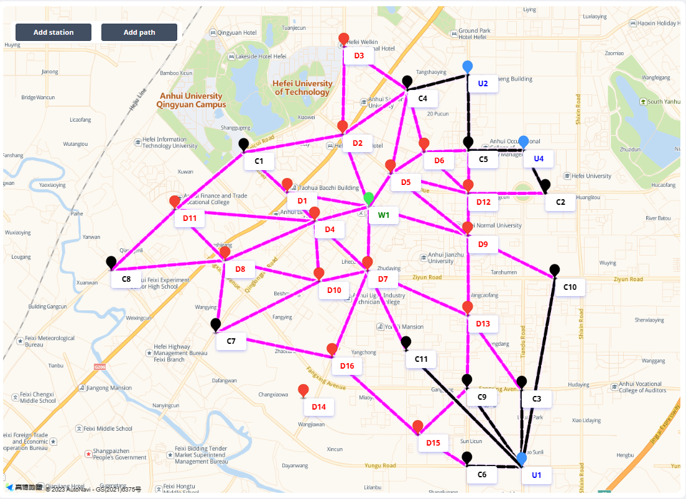
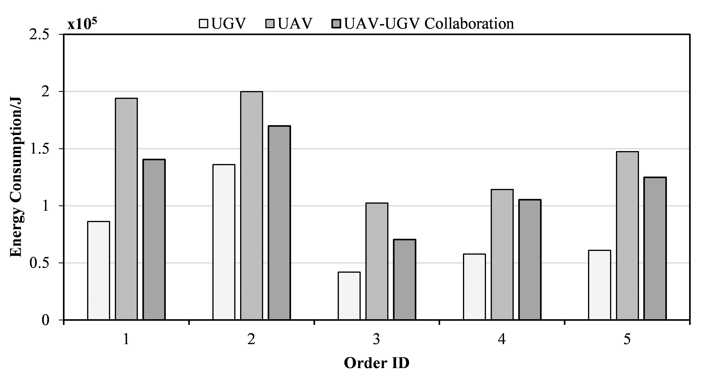
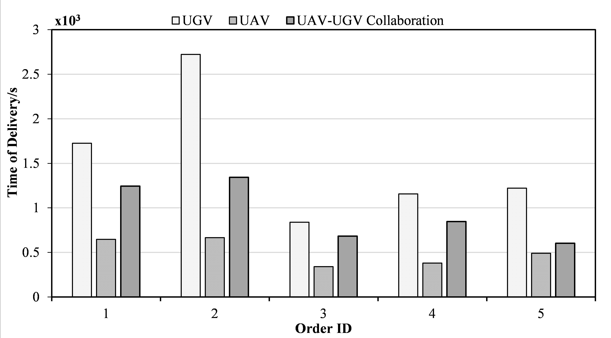
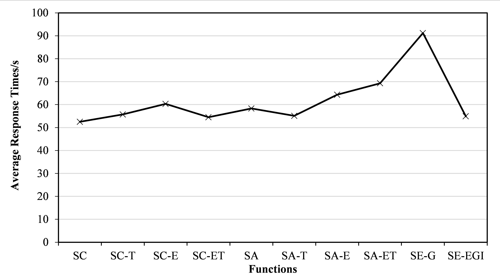

# EXPRESS
* 边缘计算中面向智慧物流的服务协同管理系统
* 在现有的EdgeWorkflow系统 (https://github.com/ISEC-AHU/EdgeWorkflow) 的基础上，EXPRESS系统设计并实现了配送服务协同管理模块、智能服务协同管理模块和隐私保护与安全管理模块，能够实现对无人机和无人车配送服务协同过程的监控、协同方案的优化，部署和管理相关智能服务，同时保证服务协同的安全性。
* 提供多维度可视化的服务协同过程监控；提供多指标优化的无人机/无人车配送服务协同方案生成策略；提供多方位可靠的安全防护技术；
* EXPRESS系统的前端采用Bootstrap框架，后端采用Spring Boot、OpenCV开源框架，边缘计算环境采用无服务器架构Serverless。
* 演示视频：
# 开发人员
* 开发单位:
1. 安徽大学计算机科学与技术学院智能软件与边缘计算（ISEC）实验室
2. 澳大利亚迪肯大学信息技术学院
3. 澳大利亚斯威本科技大学计算技术系
* 成员：张政、汤凤杰、方明燕、刘浩、张慧、徐佳
# 系统框架

EXPRESS系统的框架如下图所示，它分为服务层、服务协同管理层、安全管理层，边缘计算基础设施层。首先是服务层，边缘计算AIoT系统中的配送服务和智能服务通过工作流系统接口（EdgeWorkflow）完成服务请求与服务资源的建模与优化。其次，无人机或无人车向服务协同管理层发出服务请求。其中，配送服务请求通过配送服务分析器获取服务请求的特征与需求，并使用服务组合与选择策略生成最优服务组合和服务选择方案，并发送至执行器进行执行；智能服务请求通过人工智能服务分析器得到对于计算任务模型与神经网络结构参数，并使用神经网络划分器得到最优服务部署方案，最后在边缘计算环境中进行部署。然后，安全层结合差分隐私技术和双因素认证技术保证了用户的个人信息的隐私性和系统的安全性。最后，系统使用学术和工业领域流行的开源无服务器框架OpenFaaS，包括OpenFaaS API网关、Prometheus、K8s API服务器，其中API网关提供对外的接口，Prometheus提供对数据的监控，K8s API服务器包含多个功能池，可用于部署各种服务或执行不同的计算任务。


# 框架评估
## 实验环境

实验环境是基于安徽省合肥市蜀山区安徽大学周围的真实地图数据生成的，如下图所示。



实验环境设置：

- 1个起始节点
- 3个目标节点
- 16个无人机(UAV)配送站
- 10无人车(UGV)配送站

无人机和无人机的参数配置如下表所示：

**无人机站**

| 无人机类型 | 空载能耗(w) | 满载能耗(w) | 速度(m/s) | 最大载重(g) | 电池容量(Ah) |
|:----------:|:----------:|:-------------:|:-----:|:-------:|:---------------:|
| 无人机<small>1</small>       |   200   |    300     | 6|  1500 |     180      |
| 无人机<small>2</small>       |   300   |    400     | 8|  3000 |     320     |
| 无人机<small>3</small>       |  400  |    500    | 10| 5000 |    400     |

**无人车站**

| 无人车类型 | 空载能耗(w) | 满载能耗(w) | 速度(m/s) | 最大载重(g) | 电池容量(Ah) |
|:----------:|:----------:|:-------------:|:-----:|:-------:|:---------------:|
| 无人车<small>1</small>       |   30   |    80     | 3|  5000 |     1500      |
| 无人车<small>2</small>       |   50   |    100     | 4|  12000 |     2100     |
| 无人车<small>3</small>       |  80  |    130    | 5| 20000 |    2500     |

## 服务组合和资源管理接口

我们在时间和能耗等指标上对UAV-UGV协同算法与其他两种策略（仅使用UAV和仅使用UGV）进行了详细的比较实验。使用EXPRESS框架的服务组合和资源管理接口来实现服务协同算法，算法接口可以在“src/main/java.com/example/core”路径中找到。
1. ServiceComposition.java
```java
int uavType = 2, ugvType = 2;/*During the service composition phase, the parameters for UAVs and
UGVs are preconfigured to generate the best service composition plan.*/
case "time":           /* Optimization Object: Shortest Time*/
                    if (environmentFlag == 0) {
                        route = routePlanUtils.getShortestTimeRoute(order.getStartStation(),   order.getConsignee(),
                                drone, car, weigh); 
                                /*To invoke the service composition algorithm, specifically the shortest
                                time algorithm, you can utilize the RoutePlanUtils.java file located at
                                src/main/java/com/example/utils/ path. This file contains the
                                implementation of the shortest time algorithm for service composition.*/
                    } else {
                        String carToUserDistance1 = GuideRoutePlanUtils.getCarToUserDistance(
                                carToCustomerService.getAllCarStationNameByCustomerName(
                                        order.getConsignee()), order.getConsignee());
                        f = 1;
                        path = OpenFaasUtils.getShortestTimePath1(order.getStartStation(), order.getConsignee()
                                , uavType - 1, ugvType - 1, weigh, carToUserDistance1);
                        String[] split2 = path.split(",");
                        route = new ArrayList<>(Arrays.asList(split2));
                    }
                    break;
```

2. ResourceAllocation.java
```java
int weigh = (int) (order.getWeight() * 1000);
Drone drone = droneService.getById(uavType);
Car car = carService.getById(ugvType); /*During the resource allocation phase, the parameters for UAVs
and UGVs need to be obtained from the delivery orders in order to generate the best resource allocation plan.*/
case "energy":       /* Optimization Object: Energy Consumption*/
                   if (environmentFlag == 0) {
                       route = routePlanUtils.getShortestEnergyRoute(order.getStartStation(), order.getConsignee(),
                               drone, car, weigh);
                               /*To invoke the resource allocation algorithm, specifically the energy
                               consumption optimization algorithm, you can utilize the GuideRoutePlanUtils.java file located at
                               src/main/java/com/example/utils/path. This file contains the
                                implementation of the energy consumption optimization algorithm for
                                resource allocation.*/
                   } else {
                       String carToUserDistance2 = GuideRoutePlanUtils.getCarToUserDistance(
                               carToCustomerService.getAllCarStationNameByCustomerName(
                                       order.getConsignee()), order.getConsignee());
                       f = 1;
                       path = OpenFaasUtils.getShortestEnergyPath2(order.getStartStation(), order.getConsignee()
                               , uavType - 1, ugvType - 1, weigh, carToUserDistance2);
                       String[] split3 = path.split(",");
                       route = new ArrayList<>(Arrays.asList(split3));
                   }
                   break;
```

1.配送能耗和时间



* 我们根据服务响应时间和交付服务开销来评估所实现的系统，衡量UAV-UGV交付系统服务开销的核心指标是配送能耗和配送时间。在比较不同配送订单的服务成本后可以发现，使用服务协作方法的配送解决方案的能量和时间成本分别比其他方法低7%-27%和27%-50%。
  


* 对于系统响应时间，我们测试了部署在OpenFaaS中的系统的10个功能模块，它们的平均响应时间都远小于250毫秒的理想服务器响应时间。

# 部署EXPRESS系统

1.  部署环境
   
 	+	开发环境: IntelliJ IDEA 2020.1 x64
	+	编程语言: Java
	+	JDK: 1.8
	+	SpringBoot: 2.6.11
 	+	mysql: 5.7.29
	+	Mybatis-Plus: 3.5.1
	+	Amap js api:1.4.15
	+	OpenFaaS
2.  部署
   	+	在IntelliJ IDEA中创建一个maven项目.
 	+	在项目目录中，使用以下命令初始化一个空的Git存储库：```	git init ```
    +	添加项目的Git仓库作为远程源：``` git remote add origin https://github.com/ISEC-AHU/EXPRESS2.0 ```
      +	获取仓库的内容到您的计算机上：``` git pull origin master ```
    +	utils包下的openfaas服务相关类OpenFaasUtils需要针对您自己部署的服务进行修改。如果您无法部署openfaas，我们提供了一种在本地运行它的方法：修改核心包中的ServiceComposition、ResourceAllocation和SecurityService，将openFaasFlag设置为0，然后重新启动项目以使用本地服务。
      +	项目操作需要多次请求Autonavi后台服务，请确保您的网络畅通无阻。
    +	我们为您提供免费的带有访问限制的js api密钥，您也可以申请新的js api密钥，只需将页面中的密钥更改为您自己的密钥即可。
      +	URL: http://localhost:8081
# 参考文献
1.	H. Xiao, C. Xu, Y. Ma, S. Yang, L. Zhong and G. Muntean, “Edge Intelligence: A Computational Task Offloading Scheme for Dependent IoT Application,” IEEE Transactions on Wireless Communications, vol. 21, no. 9, pp. 7222-7237, 2022. 
2.	S. Popoola, R. Ande, B. Adebisi, G. Gui, M. Hammoudeh and O. Jogunola, “Federated Deep Learning for Zero-Day Botnet Attack Detection in IoT-Edge Devices,” IEEE Internet of Things Journal, vol. 9, no. 5, pp. 3930-3944, 2021.
3.	J. Xu, X. Liu, X. Li, L. Zhang and Y. Yang, “EXPRESS: An Energy-Efficient and Secure Framework for Mobile Edge Computing and Blockchain based Smart Systems,” In 35th IEEE/ACM International Conference on Automated Software Engineering, 2020, pp. 1283-1286.
4.	K. Wang, L. Wang, C. Pan and H. Ren, “Deep Reinforcement Learning-based Resource Management for Flexible Mobile Edge Computing: Architectures, Applications, and Research Issues,” IEEE Vehicular Technology Magazine, vol. 17, no. 2, pp. 85-93, 2022.
5.	J. Xiong and H. Chen, “Challenges for Building a Cloud Native Scalable and Trustable Multi-Tenant AIoT Platform,” In 2020 IEEE/ACM International Conference On Computer Aided Design (ICCAD), 2020, pp. 1-8.
6.	N. Nahar, S. Zhou, G. Lewis and C. Kästner, “Collaboration Challenges in Building ML-enabled Systems: Communication, Documentation, Engineering, and Process,” In 44th International Conference on Software Engineering, 2022, pp. 413-425.
7.	S. Kim, K. Ko, H. Ko and V. Leung, “Edge-Network-Assisted Real-Time Object Detection Framework for Autonomous Driving,” IEEE Network, vol. 35, no. 1, pp. 177-183, 2021.
8.	L. Chu, X. Li, J. Xu, A. Neiat and X. Liu, “A Holistic Service Provision Strategy for Drone-as-a-Service in MEC-based UAV Delivery,” In IEEE International Conference on Web Services (ICWS), 2021, pp. 669-674.
9.	L. Khan, Y. Tun, M. Alsenwi, M. Imran, Z. Han and C. Hong, “A Dispersed Federated Learning Framework for 6G-enabled Autonomous Driving Cars,” IEEE Transactions on Network Science and Engineering, pp. 1-12, 2022.
10.	D. Xie, Y. Hu and L. Qin, “An Evaluation of Serverless Computing on X86 and ARM Platforms: Performance and Design Implications,” In 14th International Conference on Cloud Computing (CLOUD), 2021, pp. 313-321.
11.	X. Li, T. Chen, D. Yuan, J. Xu and X. Liu, “A Novel Graph-based Computation Offloading Strategy for Workflow Applications in Mobile Edge Computing,” IEEE Transactions on Services Computing, pp. 1-14, 2022.
12.	J. Xu, X. Liu, X. Li, L. Zhang, J. Jin and Y. Yang, “Energy Aware Computation Management Strategy for Smart Logistic System with MEC,” IEEE Internet of Things Journal, vol. 9, no. 11, pp. 8544-8559, 2021.
13.	J. Xu, R. Ding, X. Liu, X. Li, J. Grundy and Y. Yang, “EdgeWorkflow: One Click to Test and Deploy your Workflow Applications to the Edge,” Journal of Systems and Software, vol. 193, pp. 1-16, 2022.
14.	X. Liu, L. Fan, J. Xu, X. Li, L. Gong, J. Grundy and Y. Yang, “FogWorkflowSim: An Automated Simulation Toolkit for Workflow Performance Evaluation in Fog Computing,” In 34th IEEE/ACM International Conference on Automated Software Engineering (ASE), 2019, pp. 1114-1117.
15.	R. Li, H. Liu, G. Lou, X. Zheng, X. Liu and T. Chen, “Metamorphic Testing on Multi-module UAV Systems,” In 36th IEEE/ACM International Conference on Automated Software Engineering (ASE), 2021, pp. 1171-1173.
