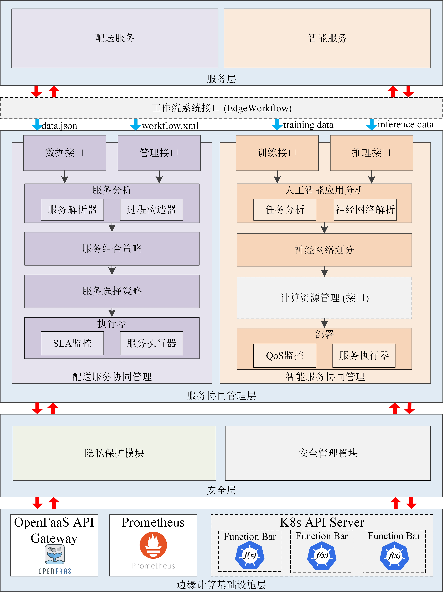

# EXPRESS
* 边缘计算中面向智慧物流的服务协同管理系统
* 在现有的EdgeWorkflow系统 (https://github.com/ISEC-AHU/EdgeWorkflow) 的基础上，EXPRESS系统设计并实现了配送服务协同管理模块、智能服务协同管理模块和隐私保护与安全管理模块。
* 演示视频：
# 开发人员
* 组织:
1. 安徽大学计算机科学与技术学院智能软件与边缘计算（ISEC）实验室
2. 迪肯大学信息技术学院
3. 斯威本科技大学计算技术系
* 成员：张政、汤凤杰、方明燕、刘浩、张慧、徐佳
# 系统框架
## 1.框架设计
EXPRESS的框架如图所示，它分为服务层、服务协同管理层、安全管理层，边缘计算基础设施层。

* 服务层位于框架的顶层，包括AIoT系统中的配送服务和智能服务，通过工作流系统接口(EdgeWorkflow)完成服务请求与服务资源的建模与优化。
* 服务协同管理层：用于解决业务服务和智能服务的协同管理问题，由业务服务协同管理模块和智能服务协同管理模块构成。业务服务协同管理模块具有三个核心功能，首先，需要从服务层接收业务服务请求，然后生成最佳的服务组合计划和服务分配方案，最后将服务请求传输至执行环境进行执行。基于上述功能需求，该模块分为四个子模块，分别是服务分析子模块、服务组合子模块、服务选择子模块和服务执行子模块。服务分析子模块基于输入的服务请求分析资源类型和过程依赖关系的要求。服务组合子模块根据服务需求生成最佳的服务组合计划。服务分配子模块包含不同的服务分配算法，用于优化服务分配计划。服务执行子模块从上述子模块接收最佳的服务分配计划，将其打包成服务请求，并发送至边缘计算环境进行执行，该模块还在服务执行过程中监控服务的性能指标。智能服务协同管理模块用于管理AIoT系统中各种智能服务的训练和推断过程，并解决上述过程中的计算资源管理问题。该模块由四个子模块组成，分别是智能应用分析子模块、智能应用分区子模块、计算资源管理子模块（仅限推断过程）和服务部署子模块。智能应用分析子模块负责AI模型评估（训练过程）和AI服务请求分析（推断过程），生成AI模型的网络结构或AI应用的特征。人工智能应用分区模块用于AI模型分区（推断过程）和AI服务组合（训练过程）。计算资源管理模块用于优化AI应用在推断过程中的卸载和调度计划。服务部署子模块负责AI模型的打包、部署（训练过程）和智能服务的执行（推断过程）。
* 安全管理层：结合差分隐私技术和双因素认证技术保证用户个人信息的隐私性和业务流程的安全性，由隐私保护模块和业务流程管理安全模块组成。隐私保护模块用于解决用户的数据隐私保护问题，例如保护用户的位置信息，该模块从与敏感数据相关的物联网设备的原始数据中提取特征数据，然后通过局部差分隐私算法对特征数据进行模糊处理。业务流程管理安全模块采用了公钥基础设施和人脸识别的双因子认证方案，保证用户身份的可靠认证，确保系统中业务流程数据的安全性。
* 边缘计算基础设施层位于框架的底层，使用学术和工业领域流行的开源无服务器框架OpenFaaS，由OpenFaaS API网关、Prometheus和K8s API服务器三个模块组成，其中API网关提供对外的接口，Prometheus提供对数据的监控，K8s API服务器包含多个功能池，可用于部署各种服务或执行不同的计算任务。
## 2.隐私保护分析与讨论
* 隐私保护模块的详细流程如图4所示，包括三个阶段：特征提取、数据扰动和数据校准。首先，将物联网设备的原始数据传输到特征提取子模块，以识别需要保护隐私的敏感特征。然后，数据最小化子模块需要减小数据特征的大小，以确保只保留隐私保护数据。在数据扰动阶段，隐私预算首先分配给每个数据特征。接下来，选择差分隐私噪声函数的类型。最后，在扰动器中对原始数据进行噪声处理。在数据校准阶段，有必要校准噪声添加后的各种类型的数据，以在抑制估计偏差的同时提高数据精度。
# 框架评估
## 实验环境

实验环境是基于安徽省合肥市蜀山区安徽大学周围的真实地图数据生成的，如下图所示。

实验环境由以下组件组成：

- 1个起始节点
- 3个目标节点
- 16个无人机(UAV)配送站
- 10无人车(UGV)配送站

无人机和无人机的参数配置如下表所示

**无人机站**

| 无人机类型 | 空载能耗(w) | 满载能耗(w) | 速度(m/s) | 最大载重(g) | 电池容量(Ah) |
|:----------:|:----------:|:-------------:|:-----:|:-------:|:---------------:|
| 无人机<small>1</small>       |   200   |    300     | 6|  1500 |     180      |
| 无人机<small>2</small>       |   300   |    400     | 8|  3000 |     320     |
| 无人机<small>3</small>       |  400  |    500    | 10| 5000 |    400     |

**无人车站**

| 无人车类型 | 空载能耗(w) | 满载能耗(w) | 速度(m/s) | 最大载重(g) | 电池容量(Ah) |
|:----------:|:----------:|:-------------:|:-----:|:-------:|:---------------:|
| 无人车<small>1</small>       |   30   |    80     | 3|  5000 |     1500      |
| 无人车<small>2</small>       |   50   |    100     | 4|  12000 |     2100     |
| 无人车<small>3</small>       |  80  |    130    | 5| 20000 |    2500     |

##服务组合和资源管理接口

我们在时间和能耗等指标上对UAV-UGV协同算法与其他两种策略（仅使用UAV和仅使用UGV）进行了详细的比较实验。使用EXPRESS框架的服务组合和资源管理接口来实现服务协同算法，算法接口可以在“src/main/java.com/example/core”路径中找到。
1. ServiceComposition.java
```java
int uavType = 2, ugvType = 2;/*During the service composition phase, the parameters for UAVs and
UGVs are preconfigured to generate the best service composition plan.*/
case "time":           /* Optimization Object: Shortest Time*/
                    if (environmentFlag == 0) {
                        route = routePlanUtils.getShortestTimeRoute(order.getStartStation(),   order.getConsignee(),
                                drone, car, weigh); 
                                /*To invoke the service composition algorithm, specifically the shortest
                                time algorithm, you can utilize the RoutePlanUtils.java file located at
                                src/main/java/com/example/utils/ path. This file contains the
                                implementation of the shortest time algorithm for service composition.*/
                    } else {
                        String carToUserDistance1 = GuideRoutePlanUtils.getCarToUserDistance(
                                carToCustomerService.getAllCarStationNameByCustomerName(
                                        order.getConsignee()), order.getConsignee());
                        f = 1;
                        path = OpenFaasUtils.getShortestTimePath1(order.getStartStation(), order.getConsignee()
                                , uavType - 1, ugvType - 1, weigh, carToUserDistance1);
                        String[] split2 = path.split(",");
                        route = new ArrayList<>(Arrays.asList(split2));
                    }
                    break;
```

2. ResourceAllocation.java
```java
int weigh = (int) (order.getWeight() * 1000);
Drone drone = droneService.getById(uavType);
Car car = carService.getById(ugvType); /*During the resource allocation phase, the parameters for UAVs
and UGVs need to be obtained from the delivery orders in order to generate the best resource allocation plan.*/
case "energy":       /* Optimization Object: Energy Consumption*/
                   if (environmentFlag == 0) {
                       route = routePlanUtils.getShortestEnergyRoute(order.getStartStation(), order.getConsignee(),
                               drone, car, weigh);
                               /*To invoke the resource allocation algorithm, specifically the energy
                               consumption optimization algorithm, you can utilize the GuideRoutePlanUtils.java file located at
                               src/main/java/com/example/utils/path. This file contains the
                                implementation of the energy consumption optimization algorithm for
                                resource allocation.*/
                   } else {
                       String carToUserDistance2 = GuideRoutePlanUtils.getCarToUserDistance(
                               carToCustomerService.getAllCarStationNameByCustomerName(
                                       order.getConsignee()), order.getConsignee());
                       f = 1;
                       path = OpenFaasUtils.getShortestEnergyPath2(order.getStartStation(), order.getConsignee()
                               , uavType - 1, ugvType - 1, weigh, carToUserDistance2);
                       String[] split3 = path.split(",");
                       route = new ArrayList<>(Arrays.asList(split3));
                   }
                   break;
```

1.配送能耗和时间

* 我们根据服务响应时间和交付服务开销来评估所实现的系统，衡量UAV-UGV交付系统服务开销的核心指标是配送能耗和配送时间。在比较不同配送订单的服务成本后可以发现，使用服务协作方法的配送解决方案的能量和时间成本分别比其他方法低7%-27%和27%-50%。
* 对于系统响应时间，我们测试了部署在OpenFaaS中的系统的10个功能模块，它们的平均响应时间都远小于250毫秒的理想服务器响应时间。

# 全文访问

## 部署EXPRESS

# 参考文献
